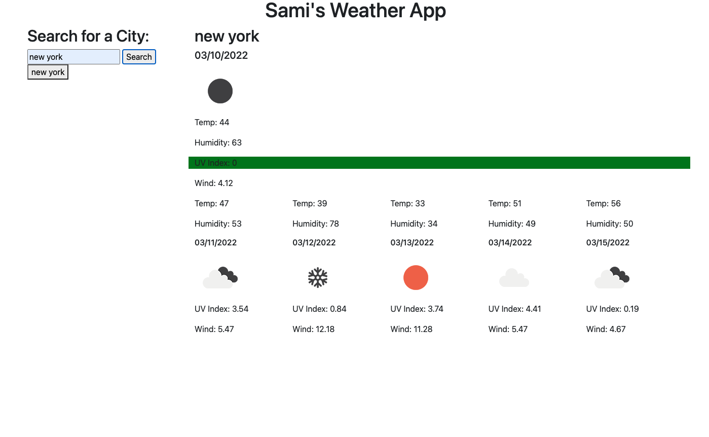
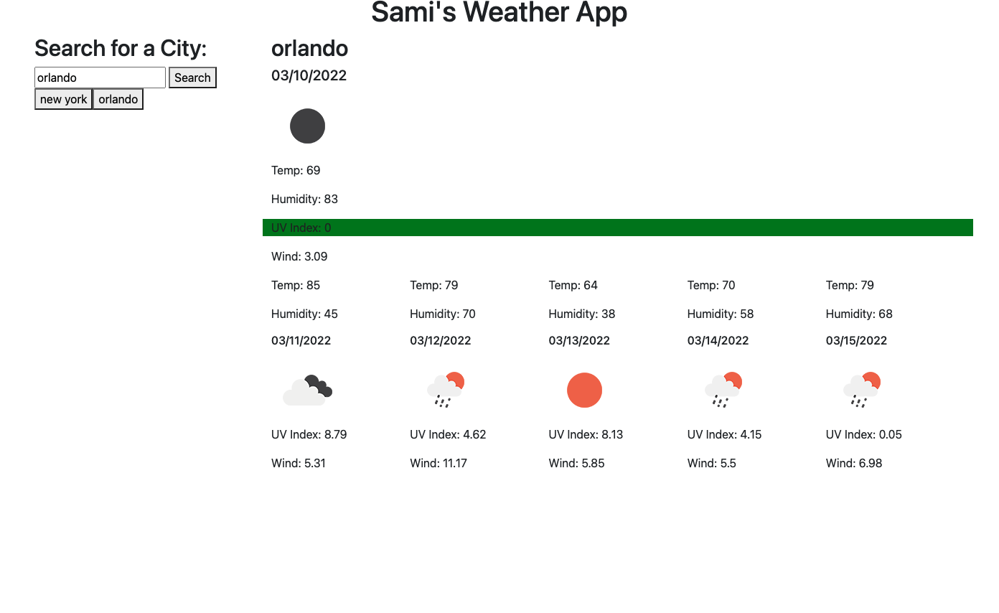

# Weather-Dash

Github Repo: https://github.com/SamiF812/Weather-Dash
Deployed App: https://samif812.github.io/Weather-Dash/

Created a weather dashboard that allows you to search for a city and view its current conditions and also the next 5 day forcast. Also stores your recently searched cities and allows you to click through them to revist that cities conditons and forecast.
The UVI is color coded by severity, green being ideal, yellow mild, red high.

